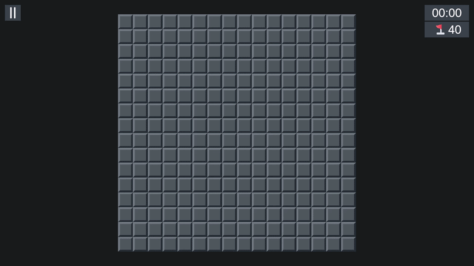

# 💣 Minesweeper – Test Task

**Minesweeper** - a classic puzzle game implemented in Unity using a service-oriented architecture.

**Tech stack:** VContainer, Unity Input System, Unity UI (uGUI), TextMeshPro, NUnit (Edit Mode Tests).

<p align="center">
  
</p>

<p align="center">
  <a href="https://dumchevdev.github.io/test-task-minesweeper/">
    
  </a>
</p>

---

## 📋 Test Task Requirements

| # | Requirement |
|---|-----------|
| 1 | **Visuals don't matter** - focus on architecture and logic |
| 2 | **Single scene** - no scene transitions between game states |
| 3 | **Field configuration** - grid size and mine count are set via `GridConfig` (ScriptableObject) |
| 4 | **Safe first click** - mines are placed after the first click, excluding the selected cell |
| 5 | **Quick restart** - pressing `R` at any time restarts the game |
| 6 | **Mouse controls** - LMB opens a cell, RMB places/removes a flag |
| 7 | **Chain reveal** - opening an empty cell iteratively reveals all neighboring cells with zero adjacent mines, and their neighbors |
| 8 | **Full game loop** - Main Menu → Game (timer + pause button) → Pause (resume / restart / exit to menu) |
| 9 | **End screen** - win/loss text, "Restart" and "Exit to Menu" buttons; restart also available via keyboard |

---

## 🧩 Architecture Overview

### 🚀 Startup and Initialization

The application has a single scene, so all services live for the entire application lifecycle. Dependency management is handled via **VContainer**:

- **`BootstrapScope`** - the root IoC container. Registers all services and launches `BootstrapFlow`.
- **`BootstrapFlow`** - entry point. In `Start()`, initializes the config and opens the main menu.
- Dependencies are split across **Installer** classes: `GameplayInstaller` and `UIInstaller`.

---

## ⚙️ Services

| Service | Description |
|--------|------------|
| `AssetProvider` | Loads resources via `Resources.Load<T>` |
| `ConfigsProvider` | Stores and provides `GridConfig`; initialized once at startup |
| `InputsService` | Wrapper over Unity Input System; translates input into `OnRestartPressed` / `OnPausePressed` events |
| `TimerService` | A simple in-game timer |
| `SessionsService` | Creates and stores the current game session; broadcasts events about session start and state changes |
| `GameFlowService` | Central point of the gameplay loop: ties together the session, timer, UI, and input |
| `UIRouter` | Manages window visibility via `UIRoot`: `ShowMainMenu`, `ShowHud`, `ShowPause`, `ShowGameOver` |
| `CellViewFactory` | Factory for creating `CellView` instances |

---

## 📋 Configs

| Config | Purpose                                                                                                                                                                                                 |
|--------|---------------------------------------------------------------------------------------------------------------------------------------------------------------------------------------------------------|
| `GridConfig` | ScriptableObject defining field dimensions and mine count. The editor includes validation (`OnValidate`): if `mineCount` exceeds the allowed maximum, it's automatically clamped with a console warning |
| `CellViewConfig` | ScriptableObject containing all cell sprites and number colors; injected into `CellView` during initialization for visual rendering                                                                     |

---

## 🎮 Gameplay

### Session and State Machine

Each game session is represented by a `SessionState` class, managed by a `SessionStateMachine`. The state machine contains four states:

```
WaitingFirstClick → Playing → Finished_Won
                            ↘ Finished_Lost
```

| State | Behavior |
|-----------|-----------|
| `WaitingFirstClickState` | On the first click (LMB or RMB), places mines excluding the selected cell, then transitions to `Playing`. If the first click was RMB, a flag is placed immediately after the transition; if LMB, the cell is opened |
| `PlayingState` | Handles cell opening and chain-reveal of empty areas; manages flag placement/removal; checks the win condition after each cell opening |
| `WonState` | Win state - blocks any further interaction with the field |
| `LostState` | Loss state - on `OnEnter()`, reveals all remaining mines on the field; blocks any further interaction |

### Mine Placement - `MinesPlacer`

Uses a partial Fisher-Yates shuffle: shuffles only the first `N` elements of the candidate list (all cells except the one clicked first).

### Chain Reveal - `FloodFiller`

Iterative stack-based flood fill (`Stack<CellData>` + `HashSet<CellData>` for visited tracking), with no recursion. Starts from the selected cell: opens it, removes its flag if present, and if the cell has no adjacent mines - pushes all unopened, mine-free neighboring cells onto the stack, continuing to reveal the connected empty area.

### Cell Data - `CellData`

Cell state is encoded via two enums:

- `CellState` (`Closed` / `Open`) - primary state
- `CellAttributes` (bit flags: `Mine`, `Flagged`, `Triggered`) - additional attributes

---

## 🖱️ Controls

| Action | Input |
|----------|------|
| Open cell | LMB on a cell |
| Place/remove flag | RMB on a cell |
| Pause / resume | HUD button or `Escape` key |
| Restart | `R` key (at any time) |

---

## 🧮 UI

The UI follows the **MVP (Model-View-Presenter)** pattern. Each screen has a View + Presenter pair:

| View | Presenter | Purpose |
|------|-----------|------------|
| `MainMenuWindow` | `MainMenuPresenter` | Start button |
| `HudWindow` | `HudPresenter` | Gameplay screen: grid, timer, flag counter, pause button |
| `PauseWindow` | `PausePresenter` | Pause menu: resume, restart, exit |
| `GameOverWindow` | `GameOverPresenter` | Game result: outcome, restart, exit |

**Grid Components:**

| Component | Purpose |
|-----------|---------|
| `GridView` | Manages layout and scaling of the grid |
| `GridPresenter` | Creates/destroys `CellView` objects; manages `CellBinding` instances |
| `CellView` | Renders individual cell state |
| `CellBinding` | Bridges `CellView` and `CellData`; subscribes to state changes and updates visuals |

`UIRoot` is a single MonoBehaviour container holding references to all windows. `UIRouter` toggles their visibility.

### HUD

- **Timer** (`TimerView`) - starts when the first cell is opened (transition to `Playing` state), stops on pause or game over.
- **Flag Counter** (`FlagCounterView`) - displays `MineCount - FlagCount`. Updated via the `OnFlagCountChanged` event in `GridPresenter`.
- **Pause Button** - pauses the game and opens `PauseWindow` when pressed.

### Grid

`GridView` manages the grid layout via `GridLayoutGroup` and automatically scales the grid based on field size. `GridPresenter` handles the creation and destruction of `CellView` objects when the field size changes.

`GridPresenter` creates `CellView` instances via `CellViewFactory` and stores a set of `CellBinding` objects linking `GridData` and `CellView`. Each `CellBinding` subscribes to `CellData` changes and calls `CellView.Render()` when the cell state updates. Flag state changes are handled centrally in `GridPresenter`, which maintains a flag counter and notifies the HUD via the `OnFlagCountChanged` event.

---

## ✅ Testing

Tests are written using **NUnit Edit Mode** and live in a separate `Minesweeper.Tests.EditMode` assembly, isolated from runtime code.

| Test Class         | What's Covered |
|--------------------|---|
| `FloodFillerTests` | Reveal of a connected empty area; reveal stops at numbered cells; flag removal when revealing a flagged cell |
| `SessionTests`     | State machine transitions (`WaitingFirstClick → Playing → Finished_Won/Lost`); first-click safety; blocking cell opening on flagged cells; mine reveal transitions session to `Finished_Lost`; opening all safe cells transitions to `Finished_Won` |
| `MinesPlacerTests` | Correct mine count placed; correct `AdjacentMineCount` calculation for every non-mine cell |

---
